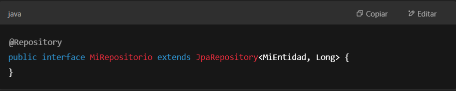

# Estructura Spring

## 1️⃣ **Clase Principal:** MiProyectoApplication.java.  
#### Es el punto de entrada de la aplicación y contiene la anotación @SpringBootApplication.  
#### ✔️ Se encarga de inicializar el contexto de Spring y lanzar la aplicación.
    

## 2️⃣ Controladores (controllers/)  
#### Aquí defines los controladores que manejan las peticiones HTTP.  
#### ✔️ Define endpoints para que los clientes (como un frontend) interactúen con la API.  
#### Ejemplo de un controlador REST:  
  

## 3️⃣ Servicios (services/)  
**Capa donde colocas la lógica de negocio, separándola de los controladores.**  
#### ✔️ Facilita la reutilización de código y separación de responsabilidades. 
 
 

## 4️⃣ Repositorios (repositories/)  
#### Aquí defines la interacción con la base de datos usando Spring Data JPA.  
#### ✔️ Se encarga de las operaciones CRUD sin necesidad de escribir código SQL manualmente.  
 

## 5️⃣ Modelos (models/)  
#### Define las entidades que se mapearán a la base de datos.  
#### ✔️ Se usa junto con JPA para representar tablas de la base de datos.  
 

